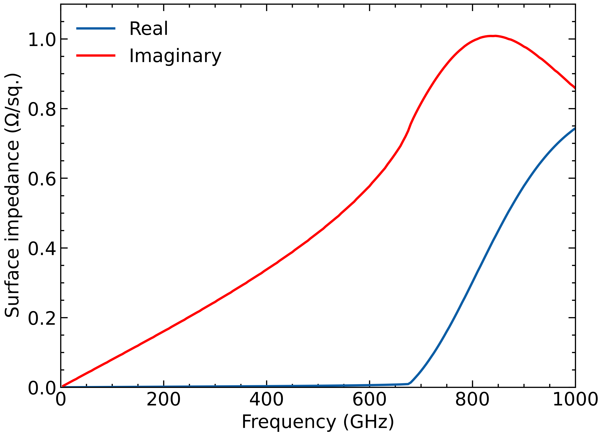

Mattis-Bardeen
==============

*Calculate the electrical properties of superconductors using Mattis-Bardeen theory.*

Installation
------------

You can install this package via:
```
python3 -m pip install git+https://github.com/garrettj403/Mattis-Bardeen.git
```

Usage
-----

Using the package is relatively straight-forward. For example, to calculate the surface impedance of a superconductor:
```python
import mattisbardeen as mb
import numpy as np 
import matplotlib.pyplot as plt 
import scipy.constants as sc

# Properties of the superconducting material, i.e., normal-state conductance,
# critical temperature, gap voltage at T=0K, and penetration depth
param = dict(sigma_n=1.74e7, Tc=8.1, Vgap0=2.65e-3, lambda0=86*sc.nano)

# Properties of the specific superconductor
d = 100e-9     # thickness of the superconducting film in [m]
T = 4.         # ambient temperature in [K]
Vgap = 2.8e-3  # gap voltage at temperature T in [V]

# Frequency in [Hz]
f = np.linspace(0, 1000, 201) * 1e9

# Surface impedance
Zs = mb.surface_impedance(f, d, T, Vgap, **param)

# Plot results
fig, ax = plt.subplots()
ax.plot(f/1e9, Zs.real, label='Real')
ax.plot(f/1e9, Zs.imag, 'r', label='Imaginary')
ax.legend()
ax.set(xlabel='Frequency (GHz)', xlim=[0, 1000],
       ylabel=r'Surface impedance ($\Omega$/sq.)', ylim=[0, 1.1])
plt.show()

```
<center>

</center>

References
----------

Mattis-Bardeen theory is described in:

   - D. C. Mattis and J. Bardeen, “Theory of the Anomalous Skin Effect in Normal and Superconducting Metals,” Phys. Rev., vol. 111, no. 2, pp. 412–417, Jul. 1958.

For the purposes of this package, I also referenced the following papers:

   - V. Y. Belitsky and E. L. Kollberg, “Superconductor–insulator–superconductor tunnel strip line: Features and applications,” J. Appl. Phys., vol. 80, no. 8, pp. 4741–4748, Oct. 1996.

   - V. Belitsky, C. Risacher, M. Pantaleev, and V. Vassilev, “Superconducting microstrip line model studies at millimetre and sub-millimetre waves,” Int. J. Infrared Millimeter Waves, vol. 27, no. 6, pp. 809–834, Feb. 2006.
   
   - A. R. Kerr, “Surface Impedance of Superconductors and Normal Conductors in EM Simulators,” Green Bank, West Virginia, 1996.

   - J. P. Turneaure, J. Halbritter, and H. A. Schwettman, “The surface impedance of superconductors and normal conductors: The Mattis-Bardeen theory,” J. Supercond., vol. 4, no. 5, pp. 341–355, Oct. 1991.

License
-------

This package is released under a [GNU General Public License, Version 3](https://github.com/garrettj403/Mattis-Bardeen/blob/master/LICENSE).
